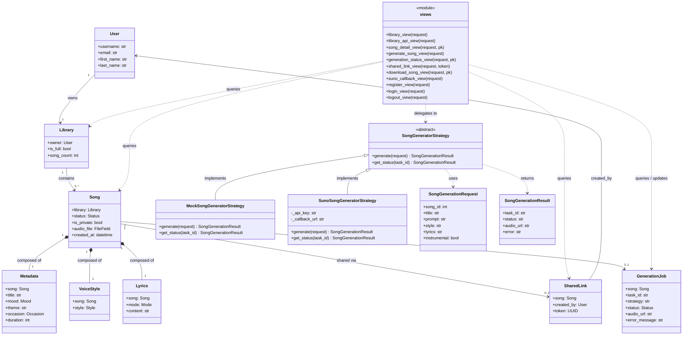
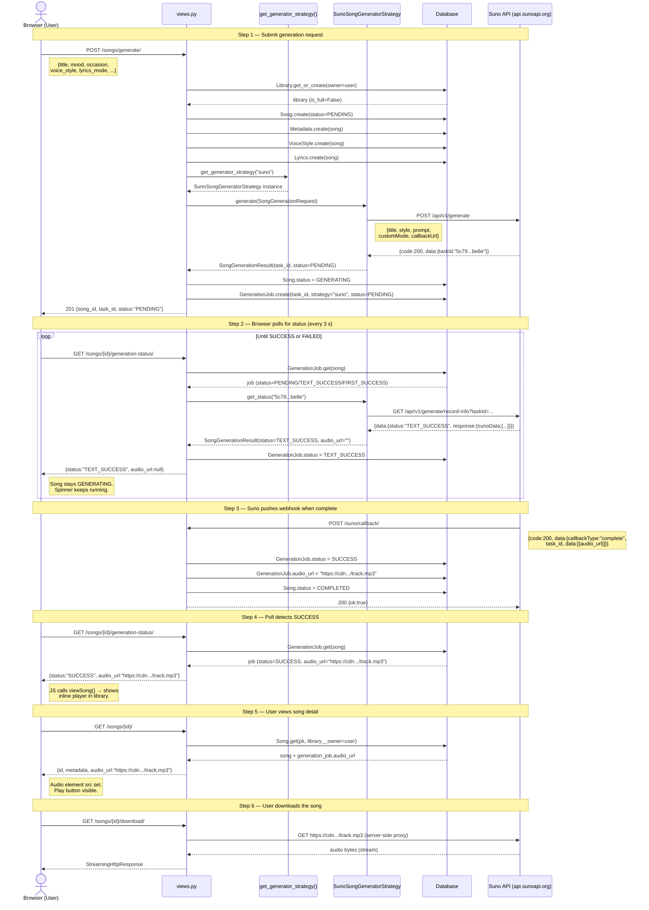

# Cithara AI Music Generator

Django 4.2 web application for the Cithara AI Music Generator.
Implements the domain model (Exercise 3) and the Strategy Pattern for pluggable song generation (Exercise 4).

> **Architecture**: Django's **Model-View-Template (MVT)** pattern.
> The class diagram and song generation sequence diagram are below.

---

## Requirements

- Python 3.10+
- pip

---

## Local Setup

### 1. Clone the repository

```bash
git clone https://github.com/TTKTako/SoftwareDesign-Ex3.git
cd SoftwareDesign-Ex3
```

### 2. Create and activate a virtual environment

```bash
# Windows
python -m venv venv
venv\Scripts\activate

# macOS / Linux
python3 -m venv venv
source venv/bin/activate
```

### 3. Install dependencies

```bash
pip install -r requirements.txt
```

### 4. Configure environment variables

Copy `.env.example` to `.env` and fill in your values:

```bash
cp .env.example .env
```

```env
SECRET_KEY="django-insecure-your-secret-key-here"

# Generation strategy: mock (default, offline) | suno (live API)
GENERATOR_STRATEGY=mock

# Required only when GENERATOR_STRATEGY=suno
SUNO_API_KEY=

GOOGLE_CLIENT_ID=
GOOGLE_CLIENT_SECRET=
```

> **Never commit `.env` to version control.** It is git-ignored. Use `.env.example` as the committed template.

### 5. Apply migrations

```bash
python manage.py migrate
```

### 6. Create a superuser (for Django Admin access)

```bash
python manage.py createsuperuser
```

### 7. Run the development server

```bash
python manage.py runserver
```

The application is available at **http://127.0.0.1:8000/**  
The admin interface is available at **http://127.0.0.1:8000/admin/**

---

## Project Structure

```
SoftwareDesign-Ex3/
├── config/                     # Django project configuration
│   ├── settings.py             # GENERATOR_STRATEGY + SUNO_API_KEY read here
│   ├── urls.py
│   ├── asgi.py
│   └── wsgi.py
├── music/                      # Core domain application
│   ├── migrations/
│   │   ├── 0001_initial.py
│   │   └── 0002_generationjob.py
│   ├── models/                 # Domain models (one file per entity)
│   │   ├── __init__.py
│   │   ├── user.py
│   │   ├── library.py
│   │   ├── song.py
│   │   ├── metadata.py
│   │   ├── voice_style.py
│   │   ├── lyrics.py
│   │   ├── shared_link.py
│   │   └── generation_job.py   # Tracks external task ID + lifecycle status
│   ├── generation/             # Strategy Pattern — song generation
│   │   ├── __init__.py         # Public API surface
│   │   ├── base.py             # SongGeneratorStrategy (ABC) + dataclasses
│   │   ├── mock_strategy.py    # Strategy A: offline / deterministic
│   │   ├── suno_strategy.py    # Strategy B: live Suno API
│   │   └── selector.py         # Centralised factory (get_generator_strategy)
│   ├── static/music/           # CSS + JS assets
│   ├── templates/music/        # HTML templates (MVT Template layer)
│   ├── admin.py                # Django Admin CRUD registrations
│   ├── views.py                # MVT View layer — request handling + rendering
│   └── urls.py                 # URL patterns
├── .env.example                # Environment variable template
├── manage.py
└── db.sqlite3                  # SQLite database (created after migrate)
```

---

## Architecture — Model-View-Template (MVT)

Django follows the **MVT** pattern, a variant of MVC where the framework itself acts as the Controller:

| MVT Layer | Django Component | This Project |
|---|---|---|
| **Model** | `django.db.models.Model` subclasses | `music/models/` — `User`, `Library`, `Song`, `Metadata`, `VoiceStyle`, `Lyrics`, `SharedLink`, `GenerationJob` |
| **View** | Python functions that handle HTTP requests | `music/views.py` — auth checks, business logic, calls Models, passes context to Templates |
| **Template** | HTML files rendered by the View | `music/templates/music/` — `app.html`, `library.html`, `login.html`, `register.html`, `share.html` |

The generation sub-system (`music/generation/`) lives inside the **Model layer** — it is domain logic (the Strategy Pattern) that the View delegates to, not HTTP handling.

---

## Class Diagram

> The diagram is organised by MVT layer. Models are in the bottom tier, Views sit above them, Templates are HTML so they are not shown as classes. The Strategy Pattern sub-system is part of the Model layer.



### Does the class diagram follow MVT?

**Yes.** Every class maps to exactly one layer with no cross-layer leakage:

| Layer | Classes | Responsibility |
|---|---|---|
| **Model** | `User`, `Library`, `Song`, `Metadata`, `VoiceStyle`, `Lyrics`, `SharedLink`, `GenerationJob`, `SongGeneratorStrategy` (+ subclasses), `SongGenerationRequest`, `SongGenerationResult` | Data persistence, domain constraints (20-song cap, private-by-default), generation logic |
| **View** | `views` module functions | HTTP request handling, auth checks, calling Models, passing context to Templates |
| **Template** | `app.html`, `library.html`, `share.html`, `login.html`, `register.html` | HTML rendering — no logic, not shown as classes |

The Strategy Pattern (`SongGeneratorStrategy`, `MockSongGeneratorStrategy`,
`SunoSongGeneratorStrategy`) lives entirely in the **Model layer** — it is domain
logic, not HTTP handling. The `views` module delegates to it but has no knowledge
of which concrete strategy is active at runtime.

---

## Song Generation — Sequence Diagram

The full lifecycle of a Suno song generation request, from the browser POST to audio being playable in the library.



### Sequence notes

| Step | Detail |
|---|---|
| **Polling vs Callback** | Both paths update the job. The webhook (Step 3) is the fast path. Polling (Step 2) is the fallback when the callback URL is not publicly reachable (e.g. local dev). |
| **Intermediate states** | `TEXT_SUCCESS` and `FIRST_SUCCESS` update `GenerationJob` only — `Song.status` stays `GENERATING` until `SUCCESS` or `FAILED`. |
| **Timeout** | Jobs older than 10 minutes that are still non-terminal are automatically marked `FAILED` by the status view. |
| **Download proxy** | Suno hosts audio on its own CDN. The `<a download>` attribute is ignored cross-origin, so the server fetches the CDN URL and streams the bytes back with `Content-Disposition: attachment`. The CDN URL is never exposed to the browser. |

---

## Domain Models

| Model | Description | Key Constraints |
|---|---|---|
| `User` | Custom user (extends `AbstractUser`) | — |
| `Library` | Personal song library, one per user | Max 20 songs enforced on `Song.save()` |
| `Song` | Generated audio track | Default `is_private=True`; status lifecycle |
| `Metadata` | Title, mood, theme, occasion, duration | OneToOne composition of `Song` |
| `VoiceStyle` | Voice type (Male/Female/Robotic/Duet) | OneToOne composition of `Song` |
| `Lyrics` | Custom / AI-generated / Instrumental | OneToOne composition of `Song` |
| `SharedLink` | UUID-based secure share token | OneToOne with `Song`; FK to creator `User` |
| `GenerationJob` | External task ID, strategy name, status, audio URL | OneToOne with `Song`; added in Exercise 4 |

> **Not persisted as models:**  
> `AudioPlayer` — pure UI component, no persistent state.  
> `AIGenerationAPI` — external third-party service; interaction tracked via `Song.status` and `GenerationJob`.

---

## Domain Model Changes from Exercise 2

| # | Exercise 2 Entity | Change | Justification |
|---|---|---|---|
| 1 | `AuthenticatedUser` / `Guest` (two subtypes) | Merged into a single `User` model | Django's session framework distinguishes authenticated vs. unauthenticated at the view layer via `request.user.is_authenticated`. A separate `Guest` row has no persistent attributes. |
| 2 | `AudioPlayer` | Removed from DB layer | Front-end UI component only (HTML5 `<audio>`). Playback state is ephemeral browser state. |
| 3 | `AIGenerationAPI` | Removed from DB layer | External service with no persistent attributes of its own. Interaction is represented by `Song.status` and `GenerationJob`. |
| 4 | `Song` (no status) | Added `status` field (`PENDING → GENERATING → COMPLETED / FAILED`) | Required for background generation (FR-2.7) and library filtering (FR-3.3). |
| 5 | `Song` (no file) | Added `audio_file` and `created_at` | `audio_file` stores the path to generated audio; `created_at` is needed for library listing date (FR-3.3). |
| 6 | `Metadata` (generic) | Made `mood` and `occasion` concrete `TextChoices` enums | FR-2.2 defines specific valid values. Enums enforce DB-level data integrity. |
| 7 | `Lyrics` (implicit) | Added explicit `mode` (`CUSTOM / AI_GENERATED / INSTRUMENTAL`) and `content` | FR-2.4/2.5 require distinguishing the three lyrics cases. |
| 8 | `VoiceStyle` (generic) | Added `style` as `TextChoices` (`MALE / FEMALE / ROBOTIC / DUET`) | FR-2.3 defines exactly four options. |

---

## CRUD Operations

### Django Admin (full CRUD)

Log in at `/admin/` with superuser credentials. All domain models are registered with search, filter, and inline editing. `Song` admin embeds `Metadata`, `VoiceStyle`, and `Lyrics` as inline forms.

### API Endpoints

| Endpoint | Method | Auth | Description |
|---|---|---|---|
| `/library/` | GET | Yes | Render library page (HTML) |
| `/library/api/` | GET | Yes | List all completed songs as JSON |
| `/songs/<id>/` | GET | Yes | Full detail for a specific song (owner only) |
| `/songs/generate/` | POST | Yes | Create a song and trigger generation |
| `/songs/<id>/generation-status/` | GET | Yes | Poll the current generation status |
| `/songs/<id>/download/` | GET | Yes | Stream audio as a download attachment |
| `/songs/<id>/delete/` | DELETE | Yes | Delete a song (owner only) |
| `/share/<uuid>/` | GET | No* | Public share page (metadata for all; audio for logged-in) |
| `/suno/callback/` | POST | No† | Suno webhook — updates job on completion |

\* Guests see metadata; must log in to hear audio (FR-5.3).  
† CSRF-exempt; validated by matching `task_id` against existing `GenerationJob` rows.

---

## Security Notes

- `AUTH_USER_MODEL = 'music.User'` — custom user model, ready for Argon2 and OAuth.
- Private songs cannot be accessed via URL manipulation; `song_detail_view` filters by `library__owner`.
- `SharedLink.token` is a server-side UUID (`editable=False`). Possessing the token is sufficient authorisation for metadata; audio requires login.
- API keys are stored in environment variables (never committed or exposed to the client).
- Download view proxy-streams Suno audio server-side — the CDN URL and API key are never sent to the browser.

---

## Song Generation — Strategy Pattern

```
music/generation/
├── base.py              ← SongGeneratorStrategy (ABC) + SongGenerationRequest / SongGenerationResult
├── mock_strategy.py     ← Strategy A: offline / deterministic
├── suno_strategy.py     ← Strategy B: live Suno API
├── selector.py          ← centralised factory — the only place that reads GENERATOR_STRATEGY
└── __init__.py          ← public API surface
```

### POST `/songs/generate/` — request body

```json
{
    "title":          "Summer Vibes",
    "mood":           "happy",
    "theme":          "A warm summer evening on the beach",
    "occasion":       "party",
    "voice_style":    "female",
    "lyrics_mode":    "ai_generated",
    "lyrics_content": ""
}
```

Valid enum values:
- `mood`: `happy` `sad` `energetic` `calm` `romantic` `angry` `melancholic`
- `occasion`: `birthday` `wedding` `party` `relaxation` `workout` `general`
- `voice_style`: `male` `female` `robotic` `duet`
- `lyrics_mode`: `custom` `ai_generated` `instrumental`

### Running in Mock Mode (offline, no API key needed)

```env
GENERATOR_STRATEGY=mock
```

```bash
python manage.py migrate
python manage.py runserver
```

### Running in Suno Mode (live API)

1. Get a key at <https://sunoapi.org/api-key>
2. Set in `.env`:

```env
GENERATOR_STRATEGY=suno
SUNO_API_KEY=your-actual-suno-api-key-here
SUNO_CALLBACK_URL=https://your-public-server.com/suno/callback/
```

3. Start the server: `python manage.py runserver`

> In local dev the callback URL is not reachable by Suno — the browser polling fallback will still pick up the final status.

### Where the Suno API Key Lives

| Location | Purpose |
|---|---|
| `.env` file (project root) | Your local secret — **never committed** |
| `settings.SUNO_API_KEY` | Read from `os.getenv("SUNO_API_KEY", "")` |
| `SunoSongGeneratorStrategy.__init__` | Validated at construction time; raises `ValueError` if missing |

---

## Tests

### How to Run

```bash
python manage.py test music --verbosity=2
```

Expected output:
```
Ran 86 tests in ~6s
OK
```

### Test Groups

| # | Class | Tests | What is covered |
|---|---|---|---|
| 1 | `UserModelTests` | 2 | User creation, field persistence |
| 2 | `LibraryModelTests` | 3 | Ownership, capacity (`is_full`) |
| 3 | `SongLimitTests` | 3 | 20-song hard cap, private-by-default |
| 4 | `MetadataModelTests` | 2 | Metadata composition, `__str__` |
| 5 | `VoiceStyleModelTests` | 1 | All four style choices |
| 6 | `LyricsModelTests` | 3 | Custom / instrumental / AI-generated modes |
| 7 | `SharedLinkModelTests` | 3 | UUID uniqueness, CASCADE delete |
| 8 | `CRUDOperationsTests` | 4 | Full ORM create / read / update / delete |
| 9 | `LibraryViewTests` | 3 | Auth gate, completed-songs filter |
| 10 | `SongDetailViewTests` | 3 | Ownership check, unauthenticated redirect |
| 11 | `SharedLinkViewTests` | 3 | Guest metadata-only, token authorisation |
| 12 | `MockStrategyUnitTests` | 7 | Mock strategy offline behaviour |
| 13 | `StrategySelectorTests` | 4 | Factory, case-insensitive, unknown strategy error |
| 14 | `GenerateSongViewTests` | 5 | Validation, song + job creation, auth gate |
| 15 | `GenerationStatusViewTests` | 4 | Poll endpoint, terminal states, ownership |
| 16 | `DeleteSongViewTests` | 4 | Delete owner-only, cascade, auth gate |
| 17 | `ShareSongViewTests` | 4 | Share link creation, idempotence |
| 18 | `TogglePrivacyViewTests` | 4 | Flip `is_private`, ownership check |
| 19 | `DownloadSongViewTests` | 4 | Streaming proxy, no-audio 404, auth gate |
| 20 | `GenerateNullThemeRegressionTests` | 2 | `theme=null` IntegrityError regression |
| 21 | `SunoCallbackAtomicTests` | 4 | Callback parsing, intermediate states, idempotency |


